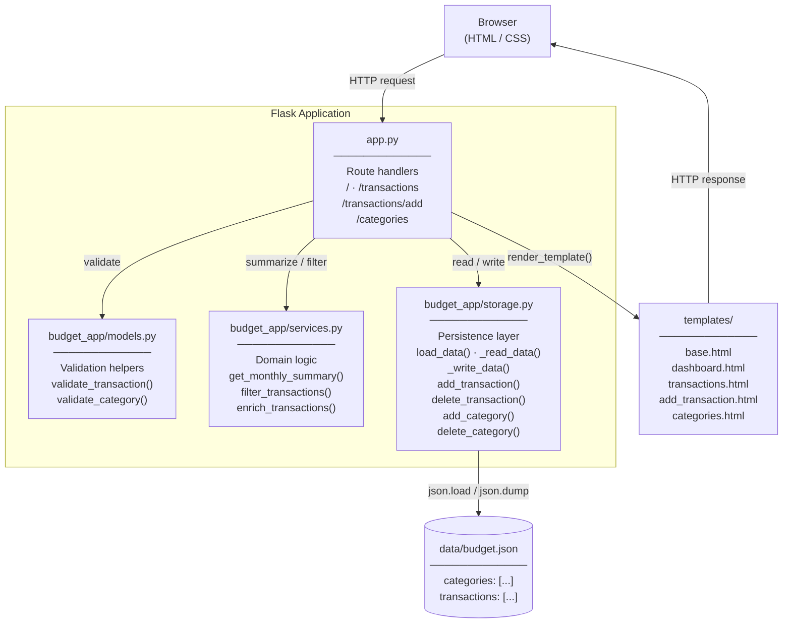

# Personal Budget Tracker

A single-user personal budget tracker built with Flask. Track income and expenses, organize transactions with categories, and review monthly summaries — all stored locally as JSON.

## Features

- Add income and expense transactions with amount, date, description, and category
- View and filter transactions by month and type
- Create and manage custom categories with color labels
- Monthly summary showing total income, total expenses, net balance, and a breakdown by category
- Inline validation with user-friendly error messages
- Persistent local JSON storage — data survives app restarts

## Architecture



### Layer responsibilities

| Layer | File | Responsibility |
|---|---|---|
| **Routes** | `app.py` | Bind URL paths to handlers; coordinate models, services, and storage; render templates |
| **Validation** | `budget_app/models.py` | Validate form inputs for transactions and categories; return field-level error dicts |
| **Domain logic** | `budget_app/services.py` | Compute monthly summaries; filter and enrich transaction lists |
| **Persistence** | `budget_app/storage.py` | Read/write `data/budget.json`; initialize default categories on first run |
| **Templates** | `templates/` | Jinja2 server-rendered pages; inherit from `base.html` |
| **Data** | `data/budget.json` | Local flat-file store holding categories and transactions |

## Project structure

```
personal-budget-tracker/
├── app.py                    # Flask app factory and route handlers
├── requirements.txt          # Python dependencies
├── budget_app/
│   ├── __init__.py
│   ├── models.py             # Input validation
│   ├── services.py           # Summary and query logic
│   └── storage.py            # JSON persistence
├── data/
│   └── budget.json           # Local data store (auto-created on first run)
├── static/
│   └── style.css
└── templates/
    ├── base.html
    ├── dashboard.html
    ├── transactions.html
    ├── add_transaction.html
    └── categories.html
```

## Getting started

### Prerequisites

- Python 3.10 or later

### Setup

```bash
# Clone the repository
git clone https://github.com/im-sandbox-lavanya/personal-budget-tracker.git
cd personal-budget-tracker

# Create and activate a virtual environment
python -m venv .venv
# Windows
.venv\Scripts\activate
# macOS / Linux
source .venv/bin/activate

# Install dependencies
pip install -r requirements.txt
```

### Run

```bash
python app.py
```

Open [http://localhost:5000](http://localhost:5000) in your browser.

`data/budget.json` is created automatically on first launch and pre-populated with default categories (Salary, Food, Transport, Housing, Healthcare, Entertainment, Other).

## Data model

### Transaction

| Field | Type | Notes |
|---|---|---|
| `id` | string (UUID) | Auto-generated |
| `type` | string | `"income"` or `"expense"` |
| `amount` | float | Must be > 0 |
| `date` | string | `YYYY-MM-DD` |
| `description` | string | Max 200 characters |
| `category_id` | string (UUID) | Must reference an existing category |

### Category

| Field | Type | Notes |
|---|---|---|
| `id` | string (UUID) | Auto-generated |
| `name` | string | Max 50 characters, unique |
| `color` | string | Hex color code used in the UI |

## Routes

| Method | Path | Description |
|---|---|---|
| `GET` | `/` | Dashboard — monthly summary and recent transactions |
| `GET` | `/transactions` | Full transaction list with month/type filters |
| `GET` / `POST` | `/transactions/add` | Add a new transaction |
| `POST` | `/transactions/delete/<id>` | Delete a transaction |
| `GET` | `/categories` | Category list |
| `POST` | `/categories/add` | Add a new category |
| `POST` | `/categories/delete/<id>` | Delete a category (blocked if in use) |

## Out of scope (MVP)

- Authentication / multi-user support
- Recurring transactions
- Budget limits and alerts
- CSV export
- Bank integrations
- Mobile sync
